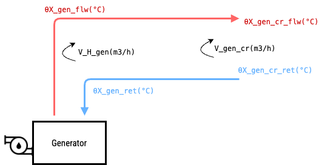
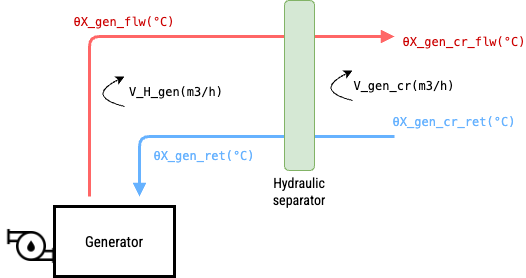

## <h1 style="color:#df1b12; margin-bottom:0px; font-weight:bold"><strong>GENERATION</strong></h1>

The annex D of EN 15316-1 standard provides the calculation procedure for the generation circuit.
It is the general procedure that can be improved using the detailed standards for different type of generator, such as Heat pump, Combustion boilers, District heating and cooling, etc. 

There are 2 typed of generaiont circuit:

1) Generation with **DIRECT** circuit withou hydraulic separtion
2) Generation with **INDIPENDENT** flow rate circuit, using the hydraulic separtion

### **DIRECT circuit**

<figure align="center">
  
  <figcaption><b>Figure 1:</b> System C5-1 - Example of sample heating circuit with varying heat exchange
</figure>

The standard define no control to the circuit. 
In the pybuildingenergy, the contol have been applied on the generator based on:
    
    - 'Type A - Based on outdoor temperature': uses primary's own weather curve
    - 'Type B - Based on demand'            : follows the secondary demand (θH_dis_flw)
    - 'Type C - Constant temperature'       : uses self.θHW_gen_flw_const 

**Constants**

*Water specific heat* - cw: 1.16 kWh/m3K

**Product data**: 

No data

**System design data**: 

No data

**Process control data**

No data

**Operating condition**

These values can be obtained simulating the thermal zone using the module iso 52016 of the library.

| Parameter | Symbol | Unit | Default | Accetable | Description |
|-----------|-------------|------|---------|---------|-------------|
Required generator output | QH_gen_out | kWh | - | 0 to ∞ | Required generator output |
Generator operation time | tH_gen_i | h | 1 | 1 to 744 | Generator operation time |
Generator circuit flow temperature | θH_gen_cr_flw | °C | - | 0 to 110 | Generator circuit flow temperature |
Generator circuit return temperature | θH_gen_cr_ret | °C | - | 0 to 110 | Generator circuit return temperature |
Generator circuit flow rate | V_H_gen_cr | m3/h | - | 0 to ∞ | Generator circuit flow rate |

### **INDEPENDENT circuit**

<figure align="center">
  
  <figcaption><b>Figure 1:</b> System C5-1 - Example of sample heating circuit with varying heat exchange
</figure>

**Constants**

*Water specific heat* - cw: 1.16 kWh/m3K

**Product data**: 

| Parameter | Symbol | Unit | Default | Accetable | Description |
|-----------|-------------|------|---------|---------|-------------|
Nominal generator power | max_output_g1 | kW | - | 0 to 104 | Manufacturer's specified heat output in kilowatts (kW) under standard operating conditions |
Nominal delta T (Δθ) water (flow-return) | dTp | °C | - | 1..40 | Standard temperature difference used for designing and evaluating HVAC systems, typically between the water entering and leaving the system |

**System design data**: 

No data

**Process control data**

| Parameter | Symbol | Unit | Default | Accetable | Description |
|-----------|-------------|------|---------|---------|-------------|
Generator pump speed control | speed_control_generator_pump| - | - | - | Generator pump speed control, could be varaible or deltaT_constant|

**Operating condition**

These values can be obtained simulating the thermal zone using the module iso 52016 of the library.

| Parameter | Symbol | Unit | Default | Accetable | Description |
|-----------|-------------|------|---------|---------|-------------|
Required generator output | QH_gen_out | kWh | - | 0 to ∞ | Required generator output |
Generator operation time | tH_gen_i | h | 1 | 1 to 744 | Generator operation time |
Generator circuit flow temperature | θH_gen_cr_flw | °C | - | 0 to 110 | Generator circuit flow temperature |
Generator circuit return temperature | θH_gen_cr_ret | °C | - | 0 to 110 | Generator circuit return temperature |
Generator circuit flow rate | V_H_gen_cr | m3/h | - | 0 to ∞ | Generator circuit flow rate |

## **Outputs**

The follwing outputs are calculated for all configurations: 

| Parameter | Symbol | Unit | Default | Accetable | Description |
|-----------|-------------|------|---------|---------|-------------|
Generation flow Temperature | Tp_sup | °C | - | - | Generation flow Temperature |
Generation return Temperature | Tp_ret | °C | - | - | Generation return Temperature |
Generation flow rate | V_H_gen | m3/h | - | - | Generation flow rate |
