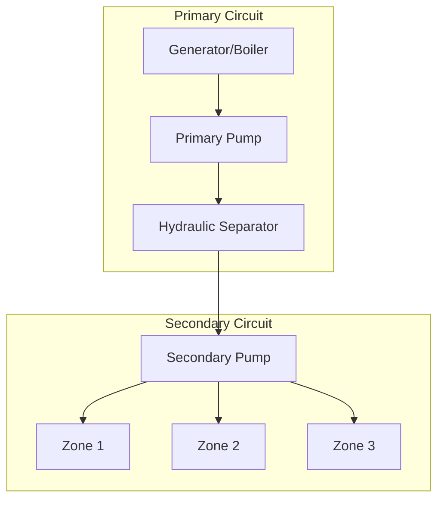
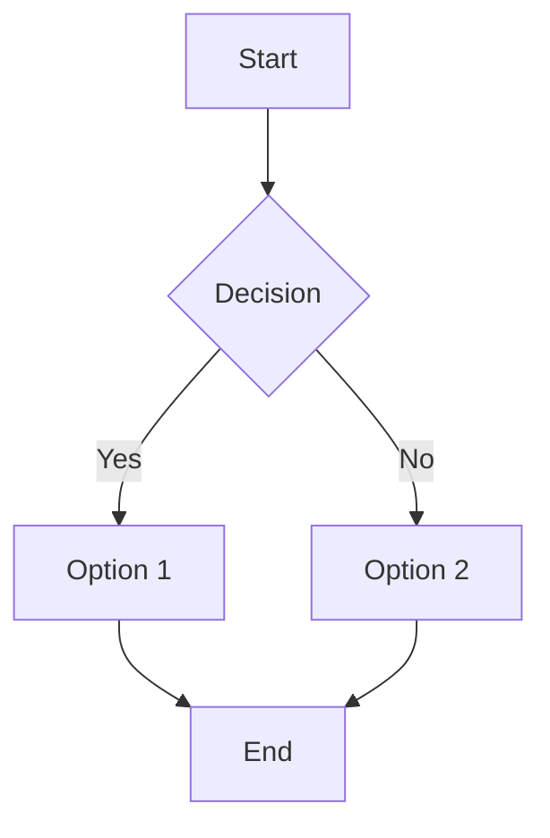

# CALCULATION PROCEDURE

<div style="background-color: #FA8072; border-left: 4px solid #800000; padding: 10px; margin: 10px 0;">
<strong>Note:</strong> THE ACTUAL CALCULATION OF PRIMARY ENRGY USING THE ISO 15316-1 IS FOR A SINGLE ZONE, IT IS NOT YET IMPLEMENTED THE CALCULATION FOR MULTIPLE ZONES.

</div>

The calculation procedure follows the direction from the energy need to the source (building energy need -> primary energy)

**Building Energy Need**: The building energy need is calculated using the module ISO 52016. For more information refers to the module ISO 52016.

**HVAC System**:Based on different type of system configuration (from type C2 to C5) the HVAC system is calculated using the ANNEX C of  ISO 15316-1. 

## Description of functions
# HeatingSystemCalculator — Guida e commento riga-per-riga (IT)

Questa guida spiega **cosa fa** lo script e **commenta ogni funzione**, con enfasi su:
- assunzioni, unità di misura e formule utilizzate;
- struttura dei dati in ingresso/uscita;
- flusso di calcolo per singolo passo e per serie temporali.

> **Standard di riferimento**: il calcolatore segue la logica della **ISO 15316-1** per i sistemi di riscaldamento e supporta 4 tipologie di circuito di emissione (C.2, C.3, C.4, C.5).

---

## 1) Panoramica rapida

- **Classe principale**: `HeatingSystemCalculator`
- **Input**: un dizionario `input_data` con parametri di **emissione**, **distribuzione** e **generazione** (primario).
- **Dati tabellari**:
  - `TB14` (DF): tabella ISO con **ΔT nominali** ed **esponente n** per il terminale (radiatori, pannelli, ecc.).  
    Se non fornita in `input_data["TB14"]`, viene usato `TB14_backup` da `global_inputs`.
- **Unità** (principali):
  - Energia: **kWh** (eccezione: `Q_H` può arrivare in Wh e viene convertito)
  - Potenza: **kW**, Perdite/Aux: **kWh**
  - Portate volumetriche: **m³/h**
  - Temperature: **°C**
  - **c_w**: calore specifico dell’acqua in **Wh/(kg·K)** (≈1.16)
- **Output**:
  - per **singolo passo**: dizionario con temperature, portate ed energie su emissione, distribuzione e generazione;
  - per **serie temporali**: DataFrame orario/temporale con la stessa struttura.

---

## 2) Struttura della classe

```python
class HeatingSystemCalculator:
    \"\"\"Calcolatore secondo ISO 15316-1 con 4 tipologie C.2–C.5.\"\"\"
```

### `__init__(self, input_data)`
- **Cosa fa**: salva l’input, carica **costanti** e **parametri** richiamando `_load_constants()` e `_load_input_parameters()`.
- **Attenzione**: `input_data` guida *tutto* (policy di controllo, efficienza generatore, curve esterne, ecc.).

---

## 3) Caricamento costanti e parametri

### `_load_constants(self)`
- **Scopo**: carica i riferimenti globali e le costanti.
- **Dettagli**:
  - Se `input_data["TB14"]` è un `pd.DataFrame`, usa quello; altrimenti usa `TB14_backup`.
  - Imposta `c_w = 1.16` Wh/(kg·K).
- **Perché serve**: `TB14` fornisce ΔT nominali ed esponente **n** per calcolare la relazione **potenza ↔ ΔT aria-emettitore**.

### `_load_input_parameters(self)`
- **Scopo**: legge dal dizionario d’ingresso i parametri di:
  - **Emissione (secondario)**: tipo emettitore, potenza nominale, efficienza, valvola di miscelazione, tipo di controllo della temperatura di mandata (domanda/esterna/costante), potenze ausiliarie, **t** operative, dati curva esterna secondaria.
  - **Distribuzione**: recupero perdite, ausiliari, coefficiente di perdita [W/K], tempo in servizio, ecc.
  - **Generazione (primario)**: potenza a pieno carico, fattore di carico max, tempo in servizio, schema idraulico (**direct** o **independent**), controllo pompa, ΔT nominale, setpoint opzionali, modello di efficienza del generatore (simple/parametric/manufacturer) e relative curve/parametri, controllo della mandata primaria (Type A/B/C) e curva esterna primaria.
- **Note importanti**:
  - `selected_emm_cont_circuit` ∈ {0,1,2,3} → C.2/C.3/C.4/C.5.
  - Policy **Q_H ≤ 0**: `calc_when_QH_positive_only` + `off_compute_mode` (`idle`/`temps`/`full`) decidono come trattare i periodi senza carico.

---

## 4) Tabelle e dati di default

### `_default_emission_data(self)`
- **Cosa fornisce**: limiti/setpoint **secondari** (emissione): T mandata max, ΔT max, T ritorno desiderata, fattore di carico con ON/OFF, T minima di mandata.
- **Perché**: servono a vincolare il calcolo dell’emettitore in funzione della domanda e del tipo C.2–C.5.

### `_default_outdoor_data(self)`
- **Cosa fornisce**: curva **climatica secondaria** (mandata min/max vs T esterna min/max).
- **Uso**: impiegata da `calculate_circuit_node_temperature` quando il controllo è “basato su esterno”.

---

## 5) Dati di serie temporali

### `load_csv_data(self, csv_path_or_df)`
- **Scopo**: carica dati orari/temporali da **CSV/DataFrame** con colonne attese:
  - `Q_H`, `T_op`, `T_ext` (alias supportati).
- **Logica**:
  - Se presente `Q_H` in **Wh**, crea `Q_H_kWh = Q_H / 1000`.
  - Salva in `self.timeseries_data`.
- **Ritorna**: DataFrame caricato.

---

## 6) Emissione — parametri comuni

### `calculate_common_emission_parameters(self, heating_needs_kWh, θint)`
- **Scopo**: calcola grandezze comuni a C.2–C.5:
  - domanda netta (dopo perdite recuperabili di sistema),
  - potenza media emessa `ΦH_em_eff` (kW) su `tH_em_i_ON`,
  - perdite/ingressi di emissione, ausiliari,
  - parametri nominali TB14: `ΔθH_em_n`, `ΔθH_em_air`, `nH_em`, portata nominale `V_H_em_nom`.
- **Note**:
  - `V_H_em_nom = ΦH_em_n / (ΔθH_em_n * c_w)`.
  - Calcola **fattore di carico** β e tempo ON parziale per ausiliari.

---

## 7) Emissione — modelli C.2/C.3/C.4/C.5

> Tutti usano la relazione non lineare **potenza ↔ ΔT aria-emettitore** con esponente **n** da TB14.

### `calculate_type_C2(self, common_params, θint)` — **C.2: portata costante, T acqua costante**
- Usa `V_H_em_nom` come portata **effettiva**.
- Stima `ΔθH_em_air_eff = Δθ_air_nom * (Φ_eff/Φ_nom)^(1/n)`.
- Calcola `θH_em_avg`, quindi ΔT acqua `ΔθH_em_w_eff = Φ_eff / (c_w * V)` e da qui **mandata**/**ritorno** emettitore.
- `θH_em_flw_min` include **offset di miscelazione** se `MIX_EM=True`.

### `calculate_type_C3(self, common_params, θint)` — **C.3: portata variabile, T emettitore costante (ritorno vincolato)**
- Fissa `θH_em_ret_set` (≥ `θint`), limita T mandata (`θH_em_flw_max`, ΔT_w_max).
- Determina `θH_em_flw` e `θH_em_ret` coerenti e ricava la **portata** da ΔT acqua.
- `θH_em_flw_min` include offset di miscelazione.

### `calculate_type_C4(self, common_params, θint)` — **C.4: ON–OFF intermittente**
- Usa un **duty cycle** per garantire l’energia oraria con potenza **ON**.
- Determina `θH_em_flw_calc` durante ON (da TB14, β richiesto).
- Fornisce minimi di mandata per il circuito di distribuzione.

### `calculate_type_C5(self, common_params, θint)` — **C.5: portata costante, scambio variabile (bypass)**
- Mantiene portata nominale; la **mandata effettiva** è il massimo tra il calcolo e il set minimo (`θH_em_flw_min_tz_i`).
- L’uscita include `θH_em_flw_min` (con margine di miscelazione).

---

## 8) Temperatura nodo circuito (secondario)

### `calculate_circuit_node_temperature(self, θext, emission_results)`
- **Scopo**: calcola la **mandata al nodo** `θH_nod_out` in base al **tipo di controllo secondario**:
  - **Type 1 – Based on demand**: usa `θH_em_flw_min` dell’emissione.
  - **Type 2 – Based on outdoor**: usa la **curva climatica** secondaria.
  - **Type 3 – Constant temperature**: usa `θem_flw_sahz_i` (costante).
- **Output**: `θH_nod_out` (°C).

---

## 9) Condizioni operative (secondario)

### `calculate_operating_conditions(self, emission_results, common_params, θint, θH_nod_out)`
- **Scopo**: combina la scelta C.2/C.3/C.4/C.5 e il nodo per generare:
  - temperature **circuito**: `θH_cr_flw`, `θH_cr_ret`, portata `V_H_cr`;
  - temperature **distribuzione** (tra collettore ed emettitore): `θH_dis_flw`, `θH_dis_ret`;
  - fattore di carico `βH_em` e mandata minima richiesta `θH_em_flw_min`;
  - **ritorno effettivo emettitore** (usato a valle).
- **Note**:
  - C.4 introduce tempo ON e calcolo di potenza in ON;
  - C.5 tiene mandata minima e calcola il ritorno dal bilancio con portata costante.

---

## 10) Distribuzione

### `calculate_distribution(self, θH_dis_flw, θH_dis_ret, θint, QH_em_i_in)`
- **Scopo**: stima le **perdite di distribuzione** e gli **ausiliari**, la parte **recuperabile** e l’energia **in ingresso** richiesta dalla distribuzione.
- **Formule chiave**:
  - Perdite [kWh] ≈ `((T_media - T_int) * U[W/K] / 1000) * t[h]`
  - Ingresso richiesto: `QH_dis_i_in = QH_dis_i_req + perdite - aux - recuperi`
  - Portata di distribuzione: `V_H_dis = QH_dis_i_in / (c_w * ΔT_dis * t)`
- **Output**: dizionario con perdite/aux/recuperi e `V_H_dis`.

---

## 11) Efficienza del generatore (primario)

### `_efficiency_from_model(self, θflw, θret, load_frac=1.0)`
- **Scopo**: restituisce l’**efficienza** (%) secondo il **modello scelto**:
  1. **simple**: euristico in funzione di `θret` (condensa alta a ritorni bassi).
  2. **parametric**: modello lineare a tratti (parametri: `eta_max`, `eta_no_cond`, `T_ret_min`, `T_ret_thr`).
  3. **manufacturer**: curve **1D** (η=f(Tret)) o **2D** (η=f(Tflw,Tret)) con interpolazione bilineare.
- **Note**: clamp a [1, 110] %; fallback a modello semplice se curve non valide.

---

## 12) Setpoint mandata primaria

### `_generator_flow_setpoint(self, θext, θH_dis_flw_demand)`
- **Scopo**: calcola il **setpoint di mandata primaria** in base al controllo selezionato:
  - **Type A – Outdoor**: usa la **curva primaria** (min/max vs T esterna).
  - **Type B – Demand**: insegue la **domanda secondaria** (`θH_dis_flw`).
  - **Type C – Constant**: usa `θHW_gen_flw_const`.

---

## 13) Generazione (primario)

### `calculate_generation(self, θH_dis_flw, θH_dis_ret, V_H_dis, QH_dis_i_in)`
- **Scopo**: calcola l’**uscita termica primaria** e i **consumi**.
- **Passi**:
  1. **Capacità max**: `max_output_g1 = P_full * LF_max * t`.
  2. **Richiesta**: `QH_gen_out = min(QH_dis_i_in, max_output_g1)`.
  3. **Masse/portate**: `ms = ρ * V_dis`.
  4. **Schemi idraulici**:
     - **direct**: primario=secondario;
     - **independent**: calcolo `ΔT_p`, setpoint mandata primaria (A/B/C), **perdite linea primaria**, portata primaria `mp = Q * 1000 / (c_w * ΔT)`, antimescolamento opzionale, ritorno `Tp_ret`.
  5. **Efficienza**: ricalcolo con temperature **effettive**.
  6. **Energetica**:
     - `EHW_gen_in = (QH_gen_out * 100) / η`
     - `EHW_gen_aux = EHW_gen_in * (aux_generator/100)`
     - Perdite recuperabili del generatore `QW_gen_i_ls_rbl_H`
     - Bilanci `QW_gen_out`, `QHW_gen_out` e ripartizione `EH_gen_in` / `EWH_gen_in`
- **Output**: dizionario con temperature primarie, portate, efficienza e consumi.

---

## 14) Esecuzione **singolo passo**

### `compute_step(self, q_h_kWh, θint, θext)`
- **Flusso**:
  1. Parametri comuni emissione
  2. Emissione C.2/C.3/C.4/C.5 (in base a `selected_emm_cont_circuit`)
  3. Calcolo **mandata nodo** (secondario)
  4. **Operating conditions** del circuito
  5. **Distribuzione**
  6. **Generazione** (primario)
  7. Composizione dell’**output** del passo (dizionario)
- **Ritorna**: tutte le **temperature**, **portate** ed **energie** del passo.

---

## 15) Esecuzione **serie temporali**

### `_temps_row_when_off(self, θint, θext)`
- **Scopo**: in assenza di carico (`Q_H ≤ 0`) e con policy `off_compute_mode='temps'`,
  calcola **solo le temperature** significative tenendo **potenze/portate=0**.

### `run_timeseries(self, df=None)`
- **Scopo**: esegue il calcolo su tutto il DataFrame temporale.
- **Alias riconosciuti**:
  - `Q_H_kWh` ↔ `Q_H`, `Q_h`, `Heating_needs`
  - `T_op` ↔ `T_int`, `theta_int`
  - `T_ext` ↔ `theta_ext`
- **Policy quando `Q_H ≤ 0`**:
  - `calc_when_QH_positive_only=False`: calcola comunque il **flusso completo**.
  - `True` con:
    - `idle`: riga “vuota” (NaN/0) — vedi `_idle_row`.
    - `temps`: riga **solo temperature** — vedi `_temps_row_when_off`.
    - `full`: calcolo **completo** anche con carico nullo.
- **Ritorna**: DataFrame indicizzato per timestamp con tutte le colonne.

---

## 16) Colonne chiave in uscita (estratto)

- **Ingressi di passo**: `Q_h(kWh)`, `T_op(°C)`, `T_ext(°C)`
- **Emissione**: `ΦH_em_eff(kW)`, `θH_em_flow(°C)`, `θH_em_ret(°C)`, `V_H_em_eff(m3/h)`, `θH_em_flw_min_req(°C)`
- **Nodo/Circuito**: `θH_nod_out(°C)`, `θH_cr_flw(°C)`, `θH_cr_ret(°C)`, `V_H_cr(m3/h)`, `βH_em(-)`
- **Distribuzione**: `Q_w_dis_i_ls(kWh)`, `Q_w_dis_i_aux(kWh)`, `Q_w_dis_i_ls_rbl_H(kWh)`, `QH_dis_i_in(kWh)`, `V_H_dis(m3/h)`
- **Generazione**: `QH_gen_out(kWh)`, `θX_gen_cr_flw(°C)`, `θX_gen_cr_ret(°C)`, `V_H_gen(m3/h)`, `efficiency_gen(%)`, `EHW_gen_in(kWh)`, `EHW_gen_aux(kWh)`

---

## 17) Esempio minimo d’uso

```python
import pandas as pd

# Serie oraria minimale
df = pd.DataFrame({
    "Q_H_kWh": [4.0, 2.0, 0.0, 3.5],
    "T_op":    [20.0, 20.0, 20.0, 20.0],
    "T_ext":   [5.0, 6.0, 7.0, 4.0],
}, index=pd.date_range("2025-01-01", periods=4, freq="H"))

inp = {
    "emitter_type": "Floor heating",
    "nominal_power": 8.0,
    "selected_emm_cont_circuit": 1,  # C.3
    "flow_temp_control_type": "Type 1 - Based on demand",
    "gen_flow_temp_control_type": "Type A - Based on outdoor temperature",
}

calc = HeatingSystemCalculator(inp)
calc.load_csv_data(df)
out = calc.run_timeseries()
print(out.head())
```

---

## 18) Buone pratiche e note

- Verificare che `TB14` contenga le **righe** per il tipo emettitore (`emitter_type`) e le **colonne**:
  - `Emitters_nominal_deltaTeta_Water_C`, `Emitters_nominale_deltaTeta_air_C`, `Emitters_exponent_n`.
- Coerenza unità: fornire **Q_H** in **kWh** (o **Wh** con conversione automatica).
- Per schemi **independent**, valutare:
  - `generator_nominal_deltaT`, `gen_flow_temp_control_type`, `θHW_gen_flw_const`,
  - `allow_dilution` e `primary_line_loss` se si vuole modellare il nodo idraulico primario con/ senza miscelazione.
- Il modello di efficienza può essere raffinato con curve **produttore** (1D/2D) per caldaie/pompe di calore.

---

## 19) Mappa funzioni → responsabilità

| Funzione | Responsabilità principale |
|---|---|
| `_load_constants` | Costanti globali e `TB14` |
| `_load_input_parameters` | Lettura di tutti i parametri (emissione, distribuzione, generazione) |
| `_default_emission_data`, `_default_outdoor_data` | Default per limiti/setpoint e curva climatica secondaria |
| `load_csv_data` | Caricamento timeseries e normalizzazione energia |
| `calculate_common_emission_parameters` | Parametri comuni emissione (C.2–C.5) |
| `calculate_type_C2/C3/C4/C5` | Modelli specifici di emissione |
| `calculate_circuit_node_temperature` | Mandata al nodo secondo la policy secondaria |
| `calculate_operating_conditions` | Temperature/portate circuito e distribuzione |
| `calculate_distribution` | Perdite/ausiliari/recuperi e portata di distribuzione |
| `_efficiency_from_model` | Rendimento generatore secondo modello scelto |
| `_generator_flow_setpoint` | Setpoint mandata primaria (outdoor/demand/costante) |
| `calculate_generation` | Bilancio primario: potenza utile, efficienza, consumi |
| `compute_step` | Pipeline completa per un singolo passo |
| `_temps_row_when_off` | Riga “solo temperature” quando Q_H≤0 |
| `run_timeseries` | Esecuzione sull’intera serie temporale |

---

**Fine.**  
Se vuoi, posso aggiungere un *diagramma di flusso* (mermaid) o una *tabella parametri I/O* dettagliata per ogni funzione.


# HeatingSystemCalculator — Guida estesa con **diagramma di flusso** e **tabelle I/O** (IT)

Questo documento estende la guida con:
1) Un **diagramma di flusso** (Mermaid) del percorso di calcolo  
2) **Tabelle I/O** (ingressi/uscite/side-effects) per le funzioni principali

> Nota: richiede un renderer che supporti i blocchi `mermaid`.

---

## 1) Diagramma di flusso (panoramica)

<script type="module">
  import mermaid from 'https://cdn.jsdelivr.net/npm/mermaid@11/dist/mermaid.esm.min.mjs';
  mermaid.initialize({ startOnLoad: true });
</script>






```mermaid

flowchart TD
    A[Start] --> B[__init__(input_data)]
    B --> C[_load_constants]
    B --> D[_load_input_parameters]
    C --> E{Esecuzione?}
    D --> E

    E -->|singolo passo| F[compute_step(q_h, θint, θext)]
    E -->|serie temporali| TS[run_timeseries(df)]

    %% Pipeline singolo passo
    subgraph Pipeline compute_step
    F --> G[calculate_common_emission_parameters]
    G --> H{Tipo circuito?}
    H -->|C.2| I1[calculate_type_C2]
    H -->|C.3| I2[calculate_type_C3]
    H -->|C.4| I3[calculate_type_C4]
    H -->|C.5| I4[calculate_type_C5]
    I1 --> J[calculate_circuit_node_temperature]
    I2 --> J
    I3 --> J
    I4 --> J
    J --> K[calculate_operating_conditions]
    K --> L[calculate_distribution]
    L --> M[calculate_generation]
    M --> N[Compose outputs dict]
    end

    %% Pipeline serie temporali
    subgraph Timeseries run_timeseries
    TS --> TS0{Row loop}
    TS0 -->|Q_H ≤ 0 AND policy=idle| T0[_idle_row]
    TS0 -->|Q_H ≤ 0 AND policy=temps| T1[_temps_row_when_off]
    TS0 -->|altrimenti| T2[compute_step]
    T0 --> T3[accumula risultati]
    T1 --> T3
    T2 --> T3
    end

    N --> O[Return dict]
    T3 --> P[Return DataFrame]

```

---

## 2) Tabelle di Input/Output (funzioni principali)

### 2.1 `__init__(input_data)`
| Campo | Tipo | Descrizione |
|---|---|---|
| `input_data` | dict | Parametri di emissione, distribuzione, generazione, policy e tabelle. |
| **Output** |  | Inizializza l’istanza e richiama `_load_constants()` & `_load_input_parameters()`. |

---

### 2.2 `_load_constants()`
| Campo | Tipo | Descrizione |
|---|---|---|
| `input_data["TB14"]` (opzionale) | `pd.DataFrame` | Tabella ISO con ΔT nominali/esponente; se assente usa `TB14_backup`. |
| **Side-effects** |  | `self.TB14` assegnata; `self.c_w = 1.16`. |
| **Output** |  | Nessun ritorno esplicito. |

---

### 2.3 `_load_input_parameters()`
| Blocco | Chiavi principali | Default (esempio) |
|---|---|---|
| **Emissione** | `emitter_type`, `nominal_power`, `emission_efficiency`, `mixing_valve`, `flow_temp_control_type`, `auxiliars_power`, `emission_operation_time`, `mixing_valve_delta`, `selected_emm_cont_circuit`, `heat_emission_data`, `outdoor_temp_data`, `constant_flow_temp` | `Floor heating`, `8 kW`, `90%`, `True`, `Type 1`, `0 W`, `1 h`, `2 °C`, `0`, tabelle di default |
| **Distribuzione** | `Heat_losses_recovered`, `distribution_loss_recovery`, `simplified_approach`, `distribution_aux_recovery`, `distribution_aux_power`, `distribution_loss_coeff`, `distribution_operation_time`, `recoverable_losses` | `True`, `90%`, `80%`, `80%`, `30 W`, `48 W/K`, `1 h`, `0 kWh` |
| **Generazione** | `full_load_power`, `max_monthly_load_factor`, `tH_gen_i_ON`, `auxiliary_power_generator`, `fraction_of_auxiliary_power_generator`, `generator_circuit`, `speed_control_generator_pump`, `generator_nominal_deltaT`, `θHW_gen_flw_set`, `θHW_gen_ret_set`, `calc_when_QH_positive_only`, `fill_zeros_when_skipped`, `off_compute_mode`, `efficiency_model`, `eta_max`, `eta_no_cond`, `T_ret_min`, `T_ret_thr`, `manuf_curve_1d`, `manuf_curve_2d`, `gen_flow_temp_control_type`, `gen_outdoor_temp_data`, `θHW_gen_flw_const` | `24 kW`, `100%`, `1 h`, `0%`, `40%`, `independent`, `variable`, `20 °C`, `None`, `None`, `True`, `False`, `idle`, `simple`, `110%`, `95%`, `20 °C`, `50 °C`, `None`, `None`, `Type A`, curva primaria default, `50 °C` |

---

### 2.4 `_default_emission_data()` / `_default_outdoor_data()`
| Funzione | Output | Note |
|---|---|---|
| `_default_emission_data` | DF con `θH_em_flw_max_sahz_i`, `ΔθH_em_w_max_sahz_i`, `θH_em_ret_req_sahz_i`, `βH_em_req_sahz_i`, `θH_em_flw_min_tz_i` | Limiti/setpoint lato secondario |
| `_default_outdoor_data` | DF con `θext_min_sahz_i`, `θext_max_sahz_i`, `θem_flw_max_sahz_i`, `θem_flw_min_sahz_i` | Curva climatica secondaria |

---

### 2.5 `load_csv_data(csv_path_or_df)`
| Input | Tipo | Descrizione |
|---|---|---|
| `csv_path_or_df` | str / DataFrame | Timeseries con colonne (`Q_H`, `T_op`, `T_ext` o alias) |
| Output | DataFrame | Con eventuale `Q_H_kWh` aggiunto; salvato in `self.timeseries_data` |

---

### 2.6 `calculate_common_emission_parameters(heating_needs_kWh, θint)`
| Output (chiave) | Descrizione |
|---|---|
| `QH_sys_out_hz_i` | Richiesta netta dopo recuperi |
| `QH_em_i_in` | Energia in ingresso all’emissione |
| `ΦH_em_eff` | Potenza media su intervallo (kW) |
| `V_H_em_nom` | Portata nominale (m³/h) |
| `ΔθH_em_n`, `ΔθH_em_air`, `nH_em` | Parametri da TB14 |

---

### 2.7 `calculate_type_C2 / C3 / C4 / C5`
| Funzione | Principio | Output principali |
|---|---|---|
| `C2` | Portata **costante**, T acqua **costante** | `θH_em_flow`, `θH_em_ret`, `V_H_em_eff`, `θH_em_flw_min` |
| `C3` | Portata **variabile**, T emettitore **costante** (ritorno limitato) | `θH_em_flow`, `θH_em_ret`, `V_H_em_eff`, `θH_em_flw_min` |
| `C4` | **ON–OFF** (duty cycle) | `θH_em_flw_calc`, `θH_em_flw_min`, ecc. |
| `C5` | Portata **costante**, scambio **variabile** (bypass) | `θH_em_flow=min`, `θH_em_ret≈`, `V_H_em_eff`, `θH_em_flw_min` |

---

### 2.8 `calculate_circuit_node_temperature(θext, emission_results)`
| Controllo | Logica | Output |
|---|---|---|
| Type 1 | Domanda → `θH_em_flw_min` | `θH_nod_out` |
| Type 2 | Curva climatica secondaria | `θH_nod_out` |
| Type 3 | Costante (`θem_flw_sahz_i`) | `θH_nod_out` |

---

### 2.9 `calculate_operating_conditions(emission_results, common_params, θint, θH_nod_out)`
| Caso | Output principali |
|---|---|
| C.2 / C.3 / C.4 / C.5 | `θH_cr_flw`, `θH_cr_ret`, `V_H_cr`, `θH_dis_flw`, `θH_dis_ret`, `βH_em`, `θH_em_flw_min`, `θH_em_ret_eff` |

---

### 2.10 `calculate_distribution(θH_dis_flw, θH_dis_ret, θint, QH_em_i_in)`
| Output | Significato |
|---|---|
| `Q_w_dis_i_ls`, `Q_w_dis_i_aux`, `Q_w_dis_i_ls_rbl_H` | Perdite, ausiliari e parte recuperabile (kWh) |
| `QH_dis_i_req`, `QH_dis_i_in` | Richiesta e ingresso effettivo alla distribuzione |
| `V_H_dis` | Portata volumetrica di distribuzione (m³/h) |

---

### 2.11 `_efficiency_from_model(θflw, θret, load_frac)`
| Modelli | Descrizione |
|---|---|
| `simple` | Efficienza in funzione di T_ritorno (condensa) |
| `parametric` | Lineare a tratti con soglie (`eta_max`, `eta_no_cond`, `T_ret_min`, `T_ret_thr`) |
| `manufacturer` | Curve 1D/2D del costruttore con interpolazione |

---

### 2.12 `_generator_flow_setpoint(θext, θH_dis_flw_demand)`
| Tipo | Logica |
|---|---|
| Type A | Curva primaria (outdoor) |
| Type B | Insegue domanda secondaria |
| Type C | Costante |

---

### 2.13 `calculate_generation(θH_dis_flw, θH_dis_ret, V_H_dis, QH_dis_i_in)`
| Output | Significato |
|---|---|
| `max_output_g1`, `QH_gen_out` | Limite capacità e uscita termica (kWh) |
| `θX_gen_cr_flw`, `θX_gen_cr_ret` | Mandata/ritorno **primario** effettivi (°C) |
| `V_H_gen` | Portata primaria (m³/h) |
| `efficiency_gen` | Rendimento (%) |
| `EHW_gen_in`, `EHW_gen_aux` | Energia in ingresso e ausiliari (kWh) |
| `QW_gen_i_ls_rbl_H` | Perdite recuperabili generatore (kWh) |
| `QW_gen_out`, `QHW_gen_out`, `EH_gen_in`, `EWH_gen_in` | Bilanci termici |

---

### 2.14 `compute_step(q_h_kWh, θint, θext)`
| Input | Output |
|---|---|
| `q_h_kWh`, `θint`, `θext` | Dizionario completo con emissione, nodo/circuito, distribuzione, generazione |

---

### 2.15 `_temps_row_when_off(θint, θext)`
| Scopo | Output |
|---|---|
| Riga “solo temperature” per `Q_H ≤ 0` | Stesse chiavi principali, con potenze/portate=0 |

---

### 2.16 `run_timeseries(df=None)`
| Input | Output |
|---|---|
| `df` (opzionale) o `self.timeseries_data` | DataFrame indicizzato per timestamp con risultati di ogni passo |

---

## 3) Suggerimenti di modellazione

- Verifica coerenza tra **tipo emettitore** e righe di `TB14`.  
- Per schemi **independent**, cura `generator_nominal_deltaT`, `primary_line_loss` e `allow_dilution`.  
- Usa `manufacturer` con curve realistiche del produttore quando disponibili.

---

_Fine — versione estesa._
