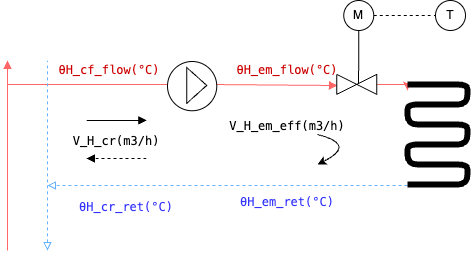
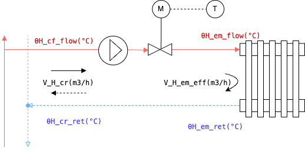
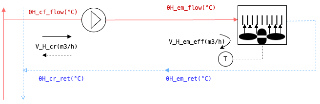

# Heating circuit.

The library provides modules for evaluating 4 types of hydraulic circuits, where, based on Table C.1 of the standard, for each circuit it is identified which type of emission system to use and the type of control. as defined below: 

| Code| Module | Emitters | Control |
|-----|--------|----------|---------|
| C2  | Constan mass flow rate and varying water temperature | Radiators and Panels| Heating curve, mixing valvew and variable generation temperature | 
| C3  | Varying mass flow (constant temperature) | Radiators, Panels, Heating coils| Thermostatic valve, flow rate control with two way valve | 
| C4  | ON-OFF and varying temperature | Radiators and Panels| On-Off control| 
| C5  | Varying heat exchange | Fan-coil, heating coils| emitters with on-off blower  and continuos circulation 3 way by-pass valve control|

All modules allow the us of a mixing valve to allow different temperatures in the different circuits. A distinction is made between: 
- the emitter tmperature and flow rate;
- the circuit temperature and flow rate; 

They differ where there is a mixing or by-pass 3 way valve in the circuit.
## System type and input parameters

### C2 - constant mass flow rate and varying water temperature

This conffiguration is for sample heating circuit with varying temperature and constant flow, with mixing valve. 

<figure align="center">
  
  <figcaption><b>Figure 1:</b> System C2 - Example of heating circuit with varying temperature and constant flow, with mixing valve. </figcaption>
</figure>

The application and possible control parameters to be used are:

<!DOCTYPE html>
<html lang="it">
<head>
    <meta charset="UTF-8">
    <meta name="viewport" content="width=device-width, initial-scale=1.0">
    <title>Tabelle affiancate</title>
    
</head>
<body>
    

        <table>
            <thead>
                <tr>
                    <th>System Application</th>
                </tr>
            </thead>
            <tbody>
                <tr><td>Radiators</td></tr>
                <tr><td>Heating Panels</td></tr>
            </tbody>
        </table>

        <table>
            <thead>
                <tr>
                    <th>Control Parameters</th>
                </tr>
            </thead>
            <tbody>
                <tr><td>Heating curve</td></tr>
                <tr><td>flow/return Δθ</td></tr>
            </tbody>
        </table>
    

</body>
</html>

The circuit can have a mixing valve or having a different control on boiler size (ex. climatic heating curve).

### **Inputs required**

**Constants**

*Water specific heat* - cw: 1.16 kWh/m3K

**Product data**: 

| Parameter | Symbol | Unit | Default | Accetable | Description |
|-----------|-------------|------|---------|---------|-------------|
Nominal emitted power | ΦH_em_n | kW | - | 0.8..4 * heat load | Manufacturer's specified heat output in kilowatts (kW) under standard operating conditions |
Nominal delta T (Δθ) air | ΔθH_em_air | °C | - | 1..70 | Standard temperature difference used for designing and evaluating HVAC systems, typically between the water entering and leaving the system, and the air entering and leaving the system. |
Emitter exponent | nH_em | - | - | 1...1.5 | The emitter exponent is a value that defines the relationship between flow rate and pressure for an emitter|

**System data**

if a mixing valve is used, the variable **MIX_EM** == True. 

**Process control data**

| Parameter | Symbol | Unit | Default | Accetable | Description |
|-----------|-------------|------|---------|---------|-------------|
Design nominal delta T water (inlet-outlet) |ΔθH_em_n| °C | - | - | Nominal difference between the hot water supply temperature and the return water temperature in a heating system, depends on the typy of emitter, eg. Radiator: 20 (70-50), Heating floor 5 (43-38), etc.|
Mixing valve temperature overhead |ΔθH_em_mix_sahz_i| °C | - | - | Temperature overhead of the mixing valve |

**Operating condition**

These values can be obtained simulating the thermal zone using the module iso 52016 of the library.

| Parameter | Symbol | Unit | Default | Accetable | Description |
|-----------|-------------|------|---------|---------|-------------|
Internal temperature | θint | °C | - | 0-45| Indoor operative temperature of the thermal zone, it is the T_op(°C) calcualted from the module 52016 |
| Emitter heat output | QH_em_i_out | kWh | - | - | energy that sould be provided by the emission system to make up for energy need of the building. Pratically considering the energy path it si equal to the energy need of the building minus the system recoverable losses|
Operating time | tH_em_i | h | 1 | - | Operating time of the system, generally in hours|
Maximum distribution water temperature | θH_nod_out | °C | - | - | it is the maximum temperature of the ditribution system, this values depends on the type of applied control. If MIX_VALVE == False, this value is equal to the minimum of the emitter temperature θH_em_flw_min |

### C3 - varying mass flow rate and constant water temperature

This configuration is for sample heating circuit with varying mass flow rate and constant water temperature. 

<figure align="center">
  
  <figcaption><b>Figure 1:</b> System C3_1 - Example of sample heating circuit varying mass flow rate. </figcaption>
</figure>

<figure align="center">
  
  <figcaption><b>Figure 1:</b> System C3_1 - Example of sample heating circuit with series control (AHU coil). </figcaption>
</figure>

The application and possible control parameters to be used are:

<!DOCTYPE html>
<html lang="it">
<head>
    <meta charset="UTF-8">
    <meta name="viewport" content="width=device-width, initial-scale=1.0">
    <title>Tabelle affiancate</title>
    
</head>
<body>
    

        <table>
            <thead>
                <tr>
                    <th>System Application</th>
                </tr>
            </thead>
            <tbody>
                <tr><td>Radiators with thermostatic valve</td></tr>
                <tr><td>AHU coil with series control</td></tr>
                <tr><td>Panels with PID control</td></tr>
            </tbody>
        </table>

        <table>
            <thead>
                <tr>
                    <th>Control Parameters</th>
                </tr>
            </thead>
            <tbody>
                <tr><td>Maximum flow/return Δθ</td></tr>
                <tr><td>Maximum flow temperature</td></tr>
                <tr><td>Target return temperature</td></tr>
            </tbody>
        </table>
    

</body>
</html>

**Inputs required**

**Constants**

*Water specific heat* - cw: 1.16 kWh/m3K

**Product data**: 

| Parameter | Symbol | Unit | Default | Accetable | Description |
|-----------|-------------|------|---------|---------|-------------|
Nominal emitted power | ΦH_em_n | kW | - | 0.8..4 * heat load | Manufacturer's specified heat output in kilowatts (kW) under standard operating conditions |
Nominal delta T (Δθ) air | ΔθH_em_air | °C | - | 1..70 | Standard temperature difference used for designing and evaluating HVAC systems, typically between the water entering and leaving the system, and the air entering and leaving the system. |
Emitter exponent | nH_em | - | - | 1...1.5 | The emitter exponent is a value that defines the relationship between flow rate and pressure for an emitter|

**System data**

if a mixing valve is used, the variable **MIX_EM** == True. 

**Process control data**

| Parameter | Symbol | Unit | Default | Accetable | Description |
|-----------|-------------|------|---------|---------|-------------|
Design nominal delta T water (inlet-outlet) |ΔθH_em_n| °C | - | - | Nominal difference between the hot water supply temperature and the return water temperature in a heating system, depends on the typy of emitter, eg. Radiator: 20 (70-50), Heating floor 5 (43-38), etc.|
Mixing valve temperature overhead |ΔθH_em_mix_sahz_i| °C | - | - | Temperature overhead of the mixing valve |
Target return temperature | θH_em_ret_req_sahz_i| °C | - | - | Desired return temperature of the emission circuit|
Maximum flow/return Δθ | ΔθH_em_w_max_sahz_i| °C | - | - | Maximum flow/return temperature difference of the emission circuit|
Maximum flow temperature | θH_em_flw_max_sahz_i| °C | - | - | Maximum flow temperature of the emission circuit|

**Operating condition**

These values can be obtained simulating the thermal zone using the module iso 52016 of the library.

| Parameter | Symbol | Unit | Default | Accetable | Description |
|-----------|-------------|------|---------|---------|-------------|
Internal temperature | θint | °C | - | 0-45| Indoor operative temperature of the thermal zone, it is the T_op(°C) calcualted from the module 52016 |
| Emitter heat output | QH_em_i_out | kWh | - | - | energy that sould be provided by the emission system to make up for energy need of the building. Pratically considering the energy path it si equal to the energy need of the building minus the system recoverable losses|
Operating time | tH_em_i | h | 1 | - | Operating time of the system, generally in hours|
Maxium distribution water temperature | θH_nod_out | °C | - | - | it is the maximum temperature of the ditribution system, this values depends on the type of applied control. If MIX_VALVE == False, this value is equal to the minimum of the emitter temperature θH_em_flw_min |

### C4 - Intermittent flow rate module (ON-OFF)

This configuration is for sample heating circuit with intermittent flow rate and constant water temperature. 

<figure align="center">
  
  <figcaption><b>Figure 1:</b> System C4 - Example of sample heating circuit with intermittent flow rate module (ON-OFF). </figcaption>
</figure>

The application and possible control parameters to be used are:

<!DOCTYPE html>
<html lang="it">
<head>
    <meta charset="UTF-8">
    <meta name="viewport" content="width=device-width, initial-scale=1.0">
    <title>Tabelle affiancate</title>
    
</head>
<body>
    

        <table>
            <thead>
                <tr>
                    <th>System Application</th>
                </tr>
            </thead>
            <tbody>
                <tr><td>ON-OFF zone control</td></tr>
                <tr><td>ON-OFF room control</td></tr>
            </tbody>
        </table>

        <table>
            <thead>
                <tr>
                    <th>Control Parameters</th>
                </tr>
            </thead>
            <tbody>
                <tr><td>Nominal Δθ (flow rate)</td></tr>
                <tr><td>Target load factor</td></tr>
            </tbody>
        </table>
    

</body>
</html>

**Constants**

*Water specific heat* - cw: 1.16 kWh/m3K

**Product data**: 

| Parameter | Symbol | Unit | Default | Accetable | Description |
|-----------|-------------|------|---------|---------|-------------|
Nominal emitted power | ΦH_em_n | kW | - | 0.8..4 * heat load | Manufacturer's specified heat output in kilowatts (kW) under standard operating conditions |
Nominal delta T (Δθ) air | ΔθH_em_air | °C | - | 1..70 | Standard temperature difference used for designing and evaluating HVAC systems, typically between the water entering and leaving the system, and the air entering and leaving the system. |
Emitter exponent | nH_em | - | - | 1...1.5 | The emitter exponent is a value that defines the relationship between flow rate and pressure for an emitter|

**System data**

if a mixing valve is used, the variable **MIX_EM** == True. 

**Process control data**

| Parameter | Symbol | Unit | Default | Accetable | Description |
|-----------|-------------|------|---------|---------|-------------|
Design nominal delta T water (inlet-outlet) |ΔθH_em_n| °C | - | - | Nominal difference between the hot water supply temperature and the return water temperature in a heating system, depends on the typy of emitter, eg. Radiator: 20 (70-50), Heating floor 5 (43-38), etc.|
Desired load factor | βH_em_req_sahz_i| % | - | - | Desired load factor with ON/OFF control |
Set flow temperature | θH_em_flw_set| °C | - | - | Set flow temperature for the heating circuit |

**Operating condition**

These values can be obtained simulating the thermal zone using the module iso 52016 of the library.

| Parameter | Symbol | Unit | Default | Accetable | Description |
|-----------|-------------|------|---------|---------|-------------|
Internal temperature | θint | °C | - | 0-45| Indoor operative temperature of the thermal zone, it is the T_op(°C) calcualted from the module 52016 |
| Emitter heat output | QH_em_i_out | kWh | - | - | energy that sould be provided by the emission system to make up for energy need of the building. Pratically considering the energy path it si equal to the energy need of the building minus the system recoverable losses|
Operating time | tH_em_i | h | 1 | - | Operating time of the system, generally in hours|
Maxium distribution water temperature | θH_nod_out | °C | - | - | it is the maximum temperature of the ditribution system, this values depends on the type of applied control. If MIX_VALVE == False, this value is equal to the minimum of the emitter temperature θH_em_flw_min |

### C5 - Constant flow rate and variable heat exchange

<figure align="center">
  
  <figcaption><b>Figure 1:</b> System C5-1 - Example of sample heating circuit with varying heat exchange
</figure>

<figure align="center">
  
  <figcaption><b>Figure 1:</b> System C4 - Example of sample heating circuit with three way by-pass control. </figcaption>
</figure>

The application and possible control parameters to be used are:

<!DOCTYPE html>
<html lang="it">
<head>
    <meta charset="UTF-8">
    <meta name="viewport" content="width=device-width, initial-scale=1.0">
    <title>Tabelle affiancate</title>
    
</head>
<body>
    

        <table>
            <thead>
                <tr>
                    <th>System Application</th>
                </tr>
            </thead>
            <tbody>
                <tr><td>ON-OFF zone control</td></tr>
                <tr><td>ON-OFF room control</td></tr>
            </tbody>
        </table>

        <table>
            <thead>
                <tr>
                    <th>Control Parameters</th>
                </tr>
            </thead>
            <tbody>
                <tr><td>Nominal Δθ (flow rate)</td></tr>
                <tr><td>Target load factor</td></tr>
            </tbody>
        </table>
    

</body>
</html>

**Constants**

*Water specific heat* - cw: 1.16 kWh/m3K

**Product data**: 

| Parameter | Symbol | Unit | Default | Accetable | Description |
|-----------|-------------|------|---------|---------|-------------|
Nominal emitted power | ΦH_em_n | kW | - | 0.8..4 * heat load | Manufacturer's specified heat output in kilowatts (kW) under standard operating conditions |
Nominal delta T (Δθ) air | ΔθH_em_air | °C | - | 1..70 | Standard temperature difference used for designing and evaluating HVAC systems, typically between the water entering and leaving the system, and the air entering and leaving the system. |
Emitter exponent | nH_em | - | - | 1...1.5 | The emitter exponent is a value that defines the relationship between flow rate and pressure for an emitter|

**System data**

if a mixing valve is used, the variable **MIX_EM** == True. 

**Process control data**

| Parameter | Symbol | Unit | Default | Accetable | Description |
|-----------|-------------|------|---------|---------|-------------|
Design nominal delta T water (inlet-outlet) |ΔθH_em_n| °C | - | - | Nominal difference between the hot water supply temperature and the return water temperature in a heating system, depends on the typy of emitter, eg. Radiator: 20 (70-50), Heating floor 5 (43-38), etc.|
Target load factor | βH_em_req_sahz_i| % | - | - | Desired load factor with ON/OFF control |
Minimum flow temperature | θH_em_flw_min_sahz_i| °C | - | - | Minimum flow temperature of the emission circuit for a zone i|
Set flow temperature | θH_em_flw_set| °C | - | - | Set flow temperature for the heating circuit |

**Operating condition**

These values can be obtained simulating the thermal zone using the module iso 52016 of the library.

| Parameter | Symbol | Unit | Default | Accetable | Description |
|-----------|-------------|------|---------|---------|-------------|
Internal temperature | θint | °C | - | 0-45| Indoor operative temperature of the thermal zone, it is the T_op(°C) calcualted from the module 52016 |
| Emitter heat output | QH_em_i_out | kWh | - | - | energy that sould be provided by the emission system to make up for energy need of the building. Pratically considering the energy path it si equal to the energy need of the building minus the system recoverable losses|
Operating time | tH_em_i | h | 1 | - | Operating time of the system, generally in hours|
Maxium distribution water temperature | θH_nod_out | °C | - | - | it is the maximum temperature of the ditribution system, this values depends on the type of applied control. If MIX_VALVE == False, this value is equal to the minimum of the emitter temperature θH_em_flw_min |

## **Outputs**

The follwing outputs are calculated for all configurations: 

| Parameter | Symbol | Unit | Default | Accetable | Description |
|-----------|-------------|------|---------|---------|-------------|
Temperature of the flow (IN) circuit | θH_ecr_flw | °C | - | - | temperature of the circuit at the flow point - water inlet |
Temperature of the return (OUT) circuit | θH_ecr_ret | °C | - | - | temperature of the circuit at the return point - water outlet |
Flow rate of the circuit | V_H_cr | m3/h | - | - | Flow rate of the circuit |
Distribution flow temperture | θH_dis_flw | °C | - | - | temperature of the distribution circuit - water inlet |
Distribution return temperture | θH_dis_ret | °C | - | - | temperature of the distribution circuit - water outlet |
Emission Load Factor | βH_em    | - | - | - | Ratio between the average emitter power and the nominal emitter power |
Minimu required flow temperature | θH_em_flw_min | °C | - | - | Minimum required flow temperature of the emitter |
